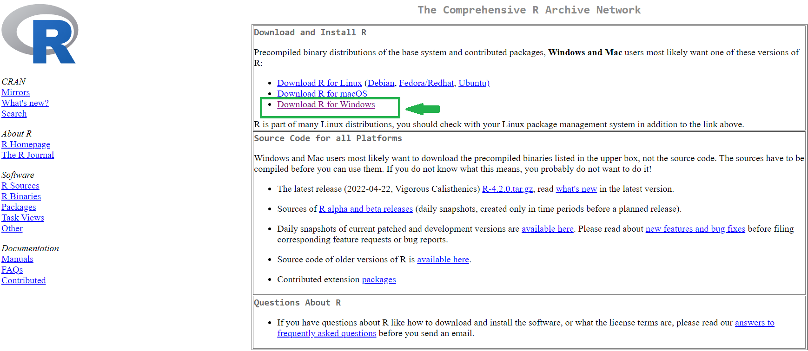
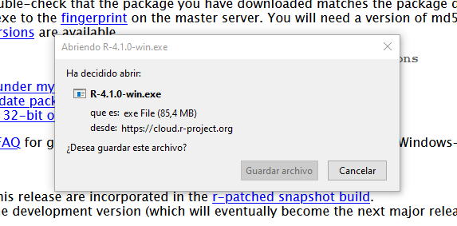
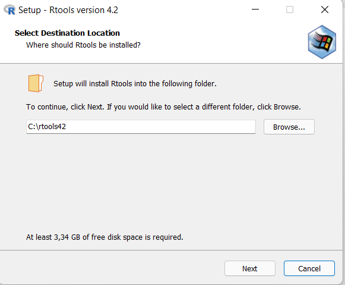
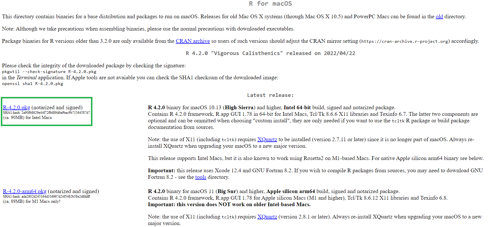
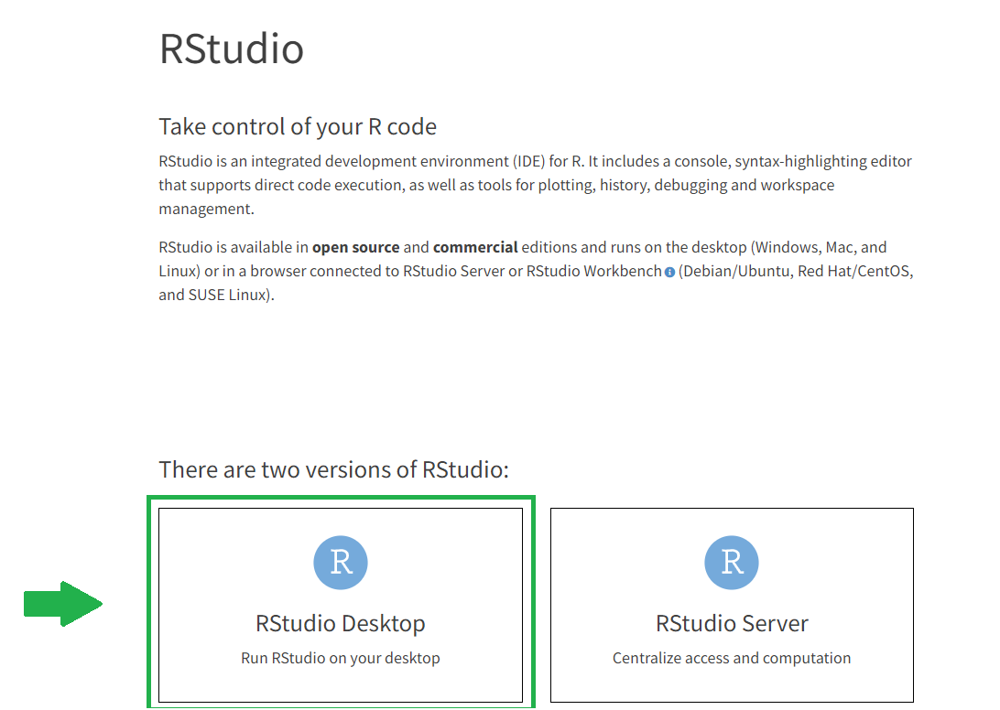

Para este curso necesitaremos tener instalado R y RStudio. Quienes tengan una versión anterior de R (4.2 es la última versión) es recomendable que realicen también estos pasos.

Para averiguar qué versión de R tienen instalado pueden mirar el primer mensaje en la consola al abrir Rstudio:


La instalación de estos programas se puede realizar en dos pasos.


# Paso 1: Instalación de R

## Para usuaries de Windows

Ir a <https://cloud.r-project.org/> y hacer clic en _Download R for Windows_.



<br>

Se abrirá la siguiente página. Hacer clic en _install R for the first time_.


<br>

Se abrirá la siguiente página. Hacer clic en _Download R-4.2.0 for Windows_.


<br>

Se abrirá el siguiente cuadro de diálogo. Hacer clic en la ventana para habilitar el botón _Guardar archivo_.



<br>

Ejecutar el archivo de instalación eligiendo las opciones por defecto.


<br>

### Instalación de Rtools

Les usuaries de Windows necesitarán además instalar **RTools**. Es importante destacar que se debe instalar la versión correspondiente a la instalación de R (para la versión de **R 4.2** y posteriores se debe utilizar **RTools42**).

Para instalar RTools deberá ir al siguiente [link](https://cran.r-project.org/bin/windows/Rtools/rtools42/rtools.html) y presionar en el link que dice _Rtools42 installer_.


Esto descargará un archivo que deberán ejecutar. Es posible que el instalador requiera algunos permisos que deberán otorgar. Es muy recomendable que mantengan todas las configuraciones por defecto, en particular, el directorio de instalación (a saber: _C:\\rtools42_), ya que de esta manera no se requerirá ninguna otra configuración y R + RTools estará listo para utilizar. 
Este programa es seguro y no instalará otra cosa que no sea RTools.



<br>

## Para los usuarios de Mac

Instalar R de <https://cran.r-project.org/bin/macosx/> siguiendo los pasos.

Se abrirá la siguiente página. Hacer clic en el link que indica la flecha roja. Instalar el archivo que se baja.



<br>

Para instalar R-Commander ([https://socialsciences.mcmaster.ca/jfox/Misc/Rcmdr/installation-notes.html)](https://socialsciences.mcmaster.ca/jfox/Misc/Rcmdr/installation-notes.html)) es necesario disponer de las librerías gráficas **X11**. Como a partir de **OS X Lion** ya no están instaladas por defecto en el sistema, es necesario instalar las librerías **Open Source XQuartz** desde <https://www.xquartz.org.>

Finalmente, abrir R. Una vez abierto, ejecutar en la consola de R para instalar **Rcmdr** el siguiente comando:

```{r eval=FALSE}
install.packages("Rcmdr", dependencies = TRUE)
```

<br>

# Paso 2: Instalación de R Studio

Instalar RStudio de <https://www.rstudio.com/products/rstudio/download/>

Seleccionar del menú _Products Rstudio (the premier IDE form R)_, luego elegir la versión para escritorio y luego la versión gratutita:



<br>

Seleccionar el sistema operativo que usarán (Windows, MAC, Linux).

Guardar y luego ejecutar para instalar.


<br>

# Paso 3: Instalación de Paquetes

En este paso vamos a instalar algunos de los paquetes que utilizaremos en el curso **Big Data e inteligencia territorial (FLACSO)**.

Existen dos formas de instalar paquetes: la consola de R o mediante la interfaz de RStudio.

Para instalar los paquetes a través de la consola es necesario escribir (o copiar y pegar) la siguiente sentencia:

```{r eval=FALSE}
install.packages("nombre_del_paquete")
```

_(recordar que el nombre del paquete siempre va entre comillas)_

Para instalar los paquetes a través de la interfaz de RStudio: Elegir la pestaña _Paquetes_ o _Packages_ (según el idioma), luego _Install_ y se nos mostrará la ventana para instalar paquetes. Luego tenemos que verificar que la fuente de donde descargamos los paquetes sea el _«repositorio CRAN»_, a continuación escribimos el nombre del paquete.

Para este curso será necesario instalar los siquientes paquetes, a través de la siguiente sentencia en la consola:

```{r eval=FALSE}
install.packages(c("tidyverse", "sf", "devtools", "ggmap", "lubridate", 
                   "leaflet", "osmdata", "osrm"))
```
